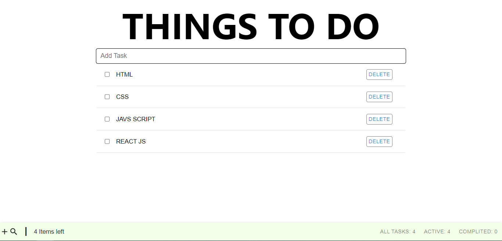

## To-Do List App

## Overview
  - This is a simple To Do List Application that helps you keep track of your tasks and organize your work.

## Features
  - Add and delete tasks
  - Mark tasks as complete
  - Check complete and active tasks
  - Search tasks

## Technologies Used
  - React
  - Material ui

## Getting Started
  - Clone the repository: <code>git clone git@github.com:SystemIntegration/react-todo-list.git</code>
  - Install dependencies: <code>npm install</code>
  - Start the development server: <code>npm start</code>

## Contributing
  - Contributions are welcome! To contribute to the project, follow these steps:
    - Fork the repository
    - Create a new branch: <code>git checkout -b my-feature-branch</code>
    - Make your changes and commit them: <code>git commit -am 'Add some feature'</code>
    - Push your changes to your branch: <code>git push origin my-feature-branch</code>
    - Create a new pull request and explain your changes

## Screenshots

## Demo
   - You can try out the application at <a href="https://systemintegration.github.io/react-todo-list">https://systemintegration.github.io/react-todo-list</a>